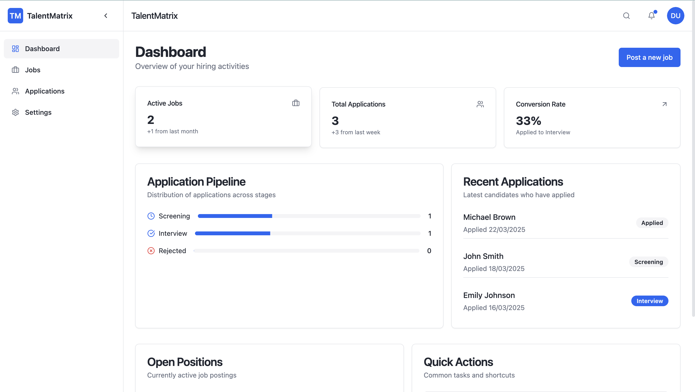

Here’s a well-structured **README** file for your project:

---

# 🚀 Talent Matrix – Smart HR Job Posting & Application Tracking System

### **Effortless Hiring & Seamless Application Tracking**



🚀 **Live Demo:** [Talent Matrix](https://basit-dev-de.github.io/talent-matrix/)

## ✨ Overview

**Talent Matrix** is a modern **HR job posting and application tracking system** designed to simplify recruitment workflows. Whether you're an HR professional, hiring manager, or recruiter, Talent Matrix **streamlines job postings, tracks applications, and enhances hiring efficiency** with a user-friendly interface.

## ⚙️ Features

### **🔹 Job Posting & Management**

- Create, edit, and manage job listings effortlessly.
- Set job requirements, categories, and deadlines.

### **📊 Applicant Tracking System (ATS)**

- Track applicants across different hiring stages.
- Filter, sort, and search candidates easily.

### **📩 Resume & Application Management**

- View, download, and evaluate resumes in one place.
- Status updates for each application.

### **👥 Multi-User Roles & Permissions**

- HR/Admin roles for job postings & application management.
- Recruiter access for screening candidates.

### **🌐 Modern UI & Smooth UX**

- Responsive & intuitive dashboard.
- Built with **React, TypeScript, and Tailwind CSS**.

## 🏗️ Tech Stack

- **Frontend:** React, TypeScript, Vite, Tailwind CSS
- **State Management:** React Context API / Zustand
- **Routing:** React Router
- **Icons:** Lucide Icons
- **Form Handling:** React Hook Form

## 🚀 Getting Started

### **Clone the Repository**

```bash
git clone https://github.com/basit-dev-de/talent-matrix.git
cd talent-matrix
```

### **Install Dependencies**

```bash
npm install
# or
yarn install
```

### **Run the Development Server**

```bash
npm run dev
# or
yarn dev
```

Open your browser and visit **`http://localhost:8080`** to see Talent Matrix in action.

## 🤝 Contributing

We welcome contributions! If you’d like to improve Talent Matrix:

1. Fork the repository
2. Create a new feature branch
3. Submit a pull request with clear documentation

## 📄 License

Talent Matrix is **open-source** under the **MIT License**. Feel free to use, modify, and contribute!

---

Let me know if you want any changes! 🚀🔥
